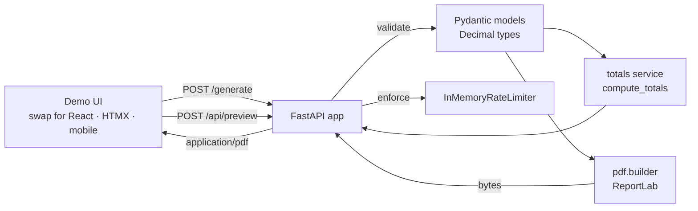

<div align="center">

# Ledgerly

**API-first FastAPI service that turns a JSON payload into a pixel-perfect invoice or quote PDF — plug in any frontend.**

[](https://github.com/YOUR_USERNAME/smart-invoice-generator/actions/workflows/ci.yml)
[](#tests)
[](https://www.python.org/)
[](https://fastapi.tiangolo.com/)
[](LICENSE)
[](https://github.com/astral-sh/ruff)

[Live demo](https://smart-invoice-generator.fly.dev/) ·
[API docs](https://smart-invoice-generator.fly.dev/docs) ·
[Report bug](https://github.com/YOUR_USERNAME/smart-invoice-generator/issues)

</div>

---

## Demo

> Screenshot/GIF coming soon. Try the [live demo](https://smart-invoice-generator.fly.dev/) or call the API directly —
> `POST /generate` returns a PDF binary in ~200 ms. No signup, no API key.

## Why this project

I built Ledgerly to solve the "ten lines of paid hours" problem freelancers
hit every month: generating clean, branded PDF invoices without paying for SaaS or wrestling
with Word templates. The result is a small but seriously engineered service:

- A single, typed JSON request returns a print-ready PDF.
- Every monetary value is `Decimal`, not `float`. Drift-free, even on awkward tax rates.
- The whole thing fits in a 256 MB Fly.io machine and starts cold in under a second.
- 100% backed by tests; 89% line coverage; sub-second test suite.

## Features

- **One JSON in, one PDF out.** `POST /generate` returns `application/pdf` directly — no HTML intermediary.
- **Framework-agnostic.** The included web UI is a demo; any client (React, HTMX, mobile app, cURL) integrates via a single POST request.
- **Live totals preview.** `POST /api/preview` returns subtotal/tax/discount/grand-total without rendering a PDF.
- **Strict validation.** Pydantic schemas enforce currency whitelist, max lengths, ISO dates, valid emails, and reject unknown fields.
- **Decimal arithmetic.** Half-up rounding to two places, parametrized regression tests.
- **Built-in rate limiting.** Sliding-window in-memory limiter with bounded keys.
- **Clean OpenAPI docs.** Tagged operations, response models, and example payloads at `/docs`.
- **Single-binary deploy.** Multi-stage Docker image with non-root user; ships to Fly.io with `fly deploy`.

## Tech stack

| Layer | Tools |
|-------|-------|
| API | FastAPI · Pydantic v2 · Starlette |
| PDF | ReportLab |
| Demo UI | Vanilla HTML/CSS/JS — swappable; the API is frontend-agnostic |
| Quality | pytest · pytest-cov · ruff · pre-commit |
| Ops | Docker · GitHub Actions · Fly.io |

## Architecture



## Quickstart

### Run with Docker (one command)

```bash
docker compose up --build
# → http://localhost:8000
```

### Run with Python locally

```bash
python -m venv venv
source venv/bin/activate              # Windows: .\venv\Scripts\activate
pip install -r requirements.txt
uvicorn main:app --reload
# → http://localhost:8000
```

Open `http://localhost:8000/` for the UI or `http://localhost:8000/docs` for the API explorer.

## API examples

### Generate a PDF

```bash
curl -X POST http://localhost:8000/generate \
  -H "Content-Type: application/json" \
  -d '{
    "doc_type": "Invoice",
    "doc_number": "2026-001",
    "issue_date": "2026-01-15",
    "due_date": "2026-02-14",
    "currency": "USD",
    "sender_name": "Acme Studio",
    "client_name": "John Smith",
    "items": [
      {"description": "Web design", "quantity": "1", "unit_price": "1500.00"},
      {"description": "Hosting (12 mo)", "quantity": "12", "unit_price": "9.99"}
    ],
    "tax_rate": "16",
    "discount_percent": "10"
  }' \
  --output invoice.pdf
```

### Preview totals (no PDF)

```bash
curl -X POST http://localhost:8000/api/preview \
  -H "Content-Type: application/json" \
  -d @examples/payload.json
```

```json
{
  "currency": "USD",
  "subtotal": "1619.88",
  "discount_percent": "10",
  "discount_amount": "161.99",
  "taxable": "1457.89",
  "tax_rate": "16",
  "tax_amount": "233.26",
  "grand_total": "1691.15"
}
```

## Bring your own frontend

The service is a pure REST API — the demo UI at `/` is optional. Any client that can send a POST request works:

**JavaScript / React / Next.js**
```js
const res = await fetch("https://your-instance/generate", {
  method: "POST",
  headers: { "Content-Type": "application/json" },
  body: JSON.stringify(payload),
});
const blob = await res.blob();
const url = URL.createObjectURL(blob);
window.open(url); // open PDF in new tab
```

**Python**
```python
import httpx
response = httpx.post("https://your-instance/generate", json=payload)
Path("invoice.pdf").write_bytes(response.content)
```

**HTMX** (zero JS, server-rendered flows)
```html
<button hx-post="/generate" hx-encoding="application/json"
        hx-swap="none" onclick="downloadPdf(event)">
  Download PDF
</button>
```

Swap the demo UI for any of these without touching the backend.

## Configuration

All settings come from environment variables. Sensible defaults are baked in.

| Variable | Default | Description |
|----------|---------|-------------|
| `PORT` | `8000` | HTTP port |
| `LOG_LEVEL` | `INFO` | Python logging level |
| `CORS_ORIGINS` | `*` | Comma-separated origins. Set to your domain in production. |
| `RATE_LIMIT_GENERATE` | `30/minute` | Per-IP cap on `/generate`. Format `N/(second|minute|hour|day)`. |

## Tests

```bash
make test            # quick run
make test-cov        # with coverage report
```

```text
37 passed in 0.33s
Coverage: 89% (threshold 80%)
```

The suite covers HTTP behaviour, Pydantic validation, Decimal arithmetic
(including parametrized rounding cases), the rate limiter, and PDF byte output.

## Deployment to Fly.io

```bash
fly auth signup       # one-time
fly launch --copy-config --no-deploy   # picks up fly.toml
fly deploy
fly open
```

The included `fly.toml` provisions a 256 MB shared-CPU machine, scales to zero
when idle, and forces HTTPS. Average cold start is ~1s.

## Project layout

```
app/
├── config.py        # env-driven settings
├── exceptions.py    # custom errors and global handlers
├── main.py          # FastAPI routes, CORS, lifespan
├── models.py        # Pydantic schemas (Decimal-typed)
├── rate_limit.py    # sliding-window limiter
├── pdf/
│   ├── builder.py   # build_pdf + section helpers
│   └── theme.py     # cached colors and paragraph styles
└── services/
    └── totals.py    # compute_totals (Decimal)

tests/               # 37 tests across api/models/pdf/totals/rate_limit
static/              # CSS + vanilla JS frontend
templates/           # Jinja2 index page
```

## Engineering decisions

- **`Decimal` everywhere money is involved.** A `float`-based subtotal of `0.10 + 0.20`
  yields `0.30000000000000004`. The test suite explicitly guards against that drift.
- **Sliding-window rate limiter, not fixed bucket.** Avoids burst-at-the-edge issues
  where a client hits `30/min` twice in two seconds across a window boundary.
- **Module-level paragraph styles via `@lru_cache`.** Building 16 ReportLab
  `ParagraphStyle` objects per request was wasteful; now they're built once.
- **`extra="forbid"` on every schema.** Defense in depth: clients sending unexpected
  fields get an explicit 422 instead of silent acceptance.

## Roadmap

- [ ] Custom logo upload (sender header)
- [ ] Multi-currency formatting per locale
- [ ] PDF/A archival mode
- [ ] Optional persistence for retrieving past documents
- [ ] OAuth-protected variant for SaaS use cases

## Contributing

See [CONTRIBUTING.md](CONTRIBUTING.md). PRs welcome.

## License

[MIT](LICENSE)

## Author

Built by **[YOUR NAME]** — available for freelance and contract work.

- Portfolio: [your-site.com](https://your-site.com)
- LinkedIn: [linkedin.com/in/your-handle](https://linkedin.com/in/your-handle)
- Email: you@your-domain.com
